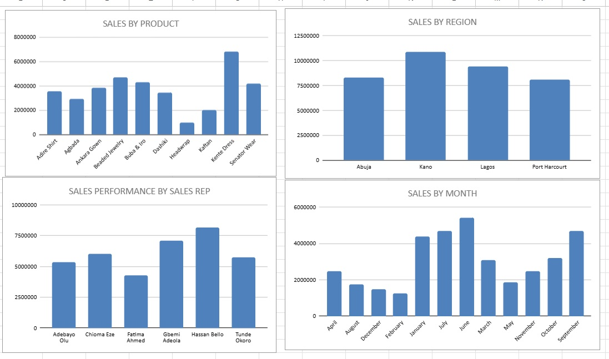
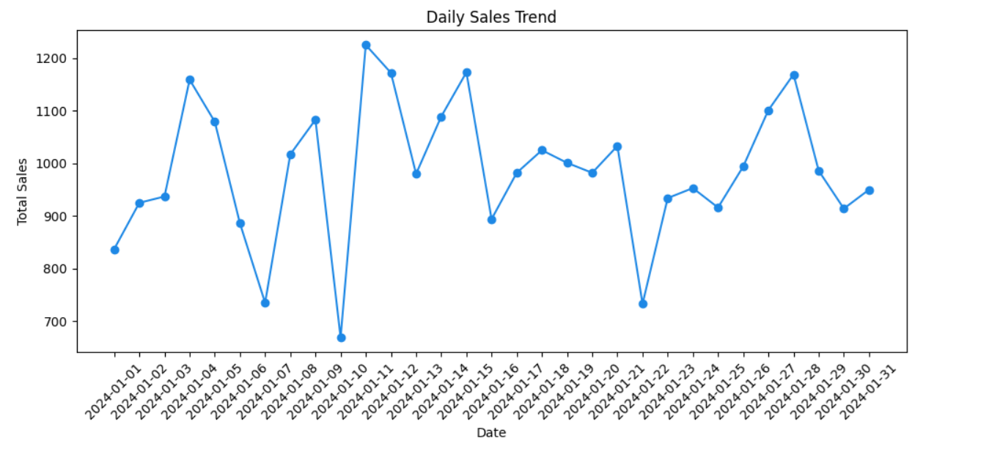
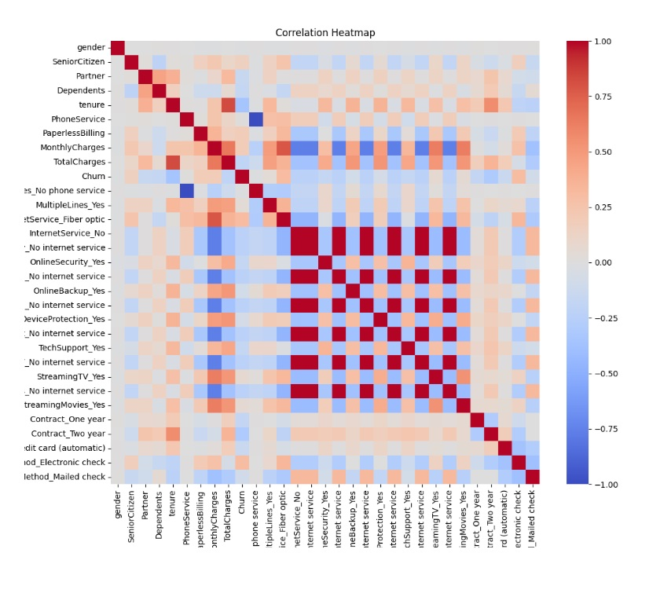

### **Ekanola Olufisayomi Arike**  
📍 Lagos, Nigeria | 📞 +234 (0) 8063607801 | 📧 olatoyeolufisayo@gmail.com  
🔗 [LinkedIn Profile](https://www.linkedin.com/in/ekanola-olufisayomi-b3543963/)

---

### **About Me**
I am a Data Scientist with a solid background in business management and client relations, combining more than five years of experience with a growing skill set in data science. I am currently pursuing an MSc in Data Science at Pan-Atlantic University, Lagos, to sharpen my analytical abilities. My goal is to leverage data-driven insights to solve complex problems and deliver impactful solutions for organizations. I thrive in dynamic environments where I can use my technical skills and problem-solving mindset to drive meaningful business growth.

---

### **Skills & Expertise**
- **Data Science & Analytics**: Python, SQL, Excel, Tableau (beginner), Power BI (beginner)
- **Data Visualization**: Creating actionable reports and insights from raw data, and developing interactive dashboards for decision-making.
- **Data-Driven Decision Making**: Translating data into actionable insights to support strategic business decisions.
- **Project Management**: Overseeing the successful delivery of events and managing resources efficiently.
- **Business Intelligence**: Using data to identify trends, improve business processes, and optimize client workflows.
- **Communication & Collaboration**: Strong interpersonal skills, experienced in client relations, team collaboration, and mentoring.

---

### **Professional Experience**

#### **Business Manager** | *Souperbfoods* | Lagos, Nigeria  
*Jan 2018 – Dec 2023*  
- Utilized data analysis techniques to monitor customer feedback and enhance overall service quality.  
- Organized online educational programs and interactive sessions that boosted client engagement.  
- Delivered strategic consultancy services to help clients streamline operations and optimize business workflows.

#### **Manager** | *Royal Mart Stores* | Lagos, Nigeria  
*Jan 2015 – Dec 2017*  
- Leveraged data analytics to track sales performance, driving a 15% increase in revenue across locations.  
- Supervised operations and staff at multiple retail stores, improving efficiency and customer service.

#### **Business Development Officer** | *Landmark Exposures Ltd* | Lagos, Nigeria  
*Aug 2012 – Dec 2014*  
- Coordinated corporate training events, optimizing vendor relationships and logistics for successful execution.  
- Led workshops and events for high-profile clients, contributing directly to business growth and client satisfaction.

---

### **Education**

- **MSc in Data Science** (In Progress) | *Pan-Atlantic University, Lagos* | *2024*  
- **BSc in Business Administration** | *University of Lagos* | *2015*  
- **SSCE** | *Opebi Grammar School, Lagos* | *2005*

---

### **Certifications**

- Customer Service Excellence Certification | *2015*  
- Data Analytics & Visualization (In Progress) | *2024*

---

### **Volunteer Experience**

- **Media House Volunteer**: Assisted with talent scouting, auditions, and event management.
- **Tutor Volunteer**: Organized and conducted educational programs, providing mentorship to students in various subjects.
- **Chrisland School ECAV**: Mentored students, fostering their creative skills through interior design and crafts workshops.

---

### **Projects**  

### **Sales Analysis Dashboard for Wearable Products**  

**Task:**  
Developed an interactive sales analysis dashboard using Google Sheets to visualize and analyze sales data from a wearable products dataset. The goal was to identify key sales trends, track performance by region, product, sales representative, and month, and provide actionable insights for business decision-making.  

**Key Achievements:**  
- Processed and analyzed a dataset containing sales transactions, covering product categories, regions, and sales representatives.  
- Created visualizations to track **sales by product, region, month, and sales rep**, highlighting top-performing categories and trends.  
- Identified peak sales months (**June and January**) and high-revenue regions (**Kano and Lagos**) to optimize marketing strategies.  
- Highlighted sales rep performance, showing variations in sales contribution and opportunities for improvement.  
- Ensured data accuracy by structuring and cleaning sales data for better decision-making.  

This project showcases my ability to work with structured sales data, create meaningful visualizations, and derive business insights to drive performance.  

[View Sales Dashboard](https://docs.google.com/spreadsheets/d/1K0Tg6Lycaixn8HUTXeyz2uMYtSPyujKknYlo7w_7N3I/edit?usp=sharing)

---

### **Sales Analysis for Wellness-Focused Restaurant Products**  

**Task:**  
Developed a comprehensive sales analysis project to examine the impact of wellness-focused product offerings in the restaurant industry. The goal was to compare their sales performance with traditional products and provide actionable insights for menu optimization and customer targeting.  

**Key Achievements:**  
- Processed and analyzed sales data, covering product categories, units sold, revenue per product, and customer demographics (age, gender, and visit frequency).  
- Created visualizations to track **sales trends by product category, revenue distribution, and customer segments**, highlighting the competitive performance of wellness-focused items.  
- Identified younger customers (aged **18-25**) as key consumers of wellness products, with frequent repeat visits.  
- Showcased wellness products like **organic kale salad and vegan smoothie** as high-performing items compared to some traditional offerings.  
- Provided recommendations for product diversification to attract health-conscious customers and boost sales.  

This project demonstrates my ability to analyze structured sales data, visualize trends, and derive meaningful business insights to guide decision-making.

[View Project in Colab](https://colab.research.google.com/drive/1AhExRiiSQWHJWwDqEa6pkpI6XSxa2uwg?usp=sharing)

---

### **Telco Customer Churn Analysis**  

This project is a  **structured machine learning workflow covering data acquisition, analysis, model building, and deployment.** aimed at analyzing and predicting customer churn in the telecommunications industry. It was conducted as part of a class exercise in the **MSc Data Science program at Pan-Atlantic University**, in collaboration with my lecturer and classmates.  

#### **Project Overview:**  
1. **Data Collection:**  
   - Retrieved telecom customer churn data from **Kaggle** using a Python script.  
2. **Exploratory Data Analysis (EDA):**  
   - Used **Matplotlib and Seaborn** for in-depth data visualization and insights.  
3. **Machine Learning Model:**  
   - Built a **churn prediction model** using **Scikit-learn**, exploring algorithms such as Logistic Regression and Decision Trees.  
   - Evaluated model performance using metrics like accuracy, precision, recall, and F1-score.  
4. **Web App Development:**  
   - Deployed an **interactive Streamlit web application** to allow users to analyze churn data and predict customer churn in real-time.  

#### **Technologies Used:**  
- **Python** (for data processing and model building)  
- **Pandas, Matplotlib, Seaborn** (for data analysis & visualization)  
- **Scikit-learn** (for machine learning model training)  
- **Streamlit** (for web-based visualization & deployment)  

This project demonstrates **end-to-end data science skills**, from data acquisition to model deployment, and showcases my ability to apply **data-driven insights** to a real-world business problem.  

[View on Github](https://github.com/OlufisayomiEkanola/Telco-Customer-Churn-Analysis)  

[View Project Dashboard](https://telco-customer-churn-analysis-olufisayomi.streamlit.app/)
---

